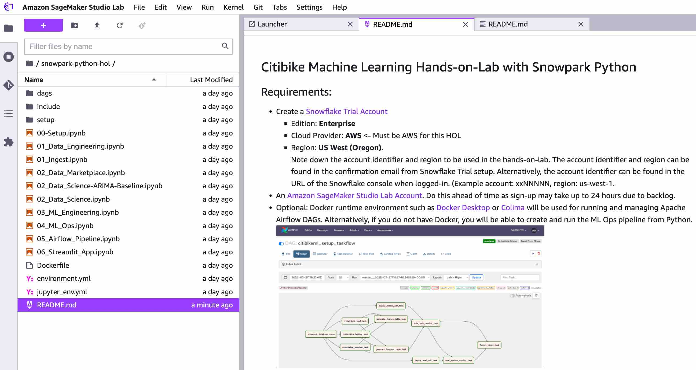

## Citibike Machine Learning Hands-on-Lab with Snowpark Python  

   


### Requirements:  
- Create a [Snowflake Trial Account](https://signup.snowflake.com/)  
    - Edition: **Enterprise**
    - Cloud Provider: **AWS** <- Must be AWS for this HOL
    - Region: **US West (Oregon)**.  
    Note down the account identifier and region to be used in the hands-on-lab.  The account identifier and region can be found in the confirmation email from Snowflake Trial setup.  Alternatively, the account identifier can be found in the URL of the Snowflake console when logged-in.  (Example account: xxNNNNN, region: us-west-1.  
- An [Amazon SageMaker Studio Lab Account](https://studiolab.sagemaker.aws/).  Do this ahead of time as sign-up may take up to 24 hours due to backlog.    
  
- Optional: Docker runtime environment such as [Docker Desktop](https://www.docker.com/products/docker-desktop/) will be used for running and managing Apache Airflow DAGs.  Alternatively, if you do not have Docker, you will be able to create and run the ML Ops pipeline from Python, albeit without all the benefits of Airflow.   

  
### Example Use-Case
In this example we use the [Citibike dataset](https://ride.citibikenyc.com/system-data). Citibike is a bicycle sharing system in New York City. Everyday users choose from 20,000 bicycles at over 1000 stations around New York City.

To ensure customer satisfaction Citibike needs to predict how many bicycles will be needed at each station. Maintenance teams from Citibike will check each station and repair or replace bicycles. Additionally, the team will relocate bicycles between stations based on predicted demand. The operations team needs an application to show how many bicycles will be needed at a given station on a given day.  
  
For this demo flow we will assume that the organization has the following **policies and processes** :   
- **Dev Tools**: Each user can develop in their tool of choice (ie. VS Code, IntelliJ, Pycharm, Eclipse, etc.).  Snowpark Python makes it possible to use any environment where they have a python kernel.  
- **Data Governance**: To preserve customer privacy no data can be stored locally.  The ingest system may store data temporarily but it must be assumed that, in production, the ingest system will not preserve intermediate data products between runs. Snowpark Python allows the user to push-down all operations to Snowflake and bring the code to the data.   
- **Automation**: Although the ML team can use any IDE or notebooks for development purposes the final product must be python code at the end of the work stream.  Well-documented, modularized code is necessary for good ML operations and to interface with the company's CI/CD and orchestration tools.  
- **Compliance**: Any ML models must be traceable back to the original data set used for training.  The business needs to be able to easily remove specific user data from training datasets and retrain models.  
  
  
### Setup Steps:

- Login to your [Snowflake Trial account](https://app.snowflake.com/) with the admin credentials that were created with the account in one browser tab (a role with ORGADMIN privileges). Keep this tab open during the hands-on-lab.  
    - Click on the Billing on the left side panel. 
    - Click on [Terms and Billing](https://app.snowflake.com/terms-and-billing).
    - Read and accept terms to continue with the hands-on-lab.
- Login to [SageMaker Studio Lab](https://studiolab.sagemaker.aws/) in another browser tab.  
    - Create a Runtime if there isn't one already  
    - Click on Start Runtime  
    - Click on Open Project  
    - Select Git -> Clone Git Repository and enter the following:  
        Repository URL: https://github.com/Snowflake-Labs/sfguide-citibike-ml-snowpark-python.  
    - Select Yes when prompted to create a conda environment.  
    - A terminal will open and create the environment.  When it is done run `conda activate snowpark_0110` in the terminal window.  
    - When opening notebooks be sure to select the "snowpark_070" kernel.  

### Alternative Client  

As an alternative to SageMaker Studio Lab this hands-on-lab can be run in Jupyter or any other notebook from a local system or anywhere a python 3.8 kernel can be installed. 

_**Note:** The `astro` cli setup as part of this repo can also run a version of Jupyter Lab on your local system, which might be quicker if you don't want to go through the conda install listed below. To use this include version of Jupyter, rename the `docker-compose.override.yml.TEMP` file to `docker-compose.override.yml` before running the `astro dev start` command detailed in the Airflow section below_

- Install Miniconda
    - For MacOS Intel Chip run:  
    ```bash
    curl https://repo.anaconda.com/miniconda/Miniconda3-latest-MacOSX-x86_64.sh -o ~/Downloads/miniconda.sh  
    sh ~/Downloads/miniconda.sh -b -p $HOME/miniconda  
    ~/miniconda/bin/conda init  
    conda update conda
    cat ~/.bash_profile >> ~/.zshrc  
    . ~/.zshrc
    ```  
   If another shell besides the Mac default zsh shell is used you must re-source the profile for that shell or open a new terminal window to pickup the miniconda shell/path changes.  
  
    - For MacOS M1 Chip run:  
    ```bash
    curl https://repo.anaconda.com/miniconda/Miniconda3-latest-MacOSX-arm64.sh -o ~/Downloads/miniconda.sh  
    sh ~/Downloads/miniconda.sh -b -p $HOME/miniconda  
    ~/miniconda/bin/conda init  
    conda update conda
    cat ~/.bash_profile >> ~/.zshrc  
    . ~/.zshrc
    ```  
   If another shell besides the Mac default zsh shell is used you must re-source the profile for that shell or open a new terminal window to pickup the miniconda shell/path changes.  
   
    - For Microsoft Windows system download [miniconda for windows](https://repo.anaconda.com/miniconda/Miniconda3-py38_4.11.0-Windows-x86_64.exe) and manually install.  

- Install git (if not already installed) on your local system.
```bash
conda install git
```  
- Create a python kernel environment. Snowpark for Python is currently supported on **Python 3.8 only**. Clone this repository and create an environment. On Mac OS run:
```
mkdir ~/Desktop/snowpark-python
cd ~/Desktop/snowpark-python
git clone https://github.com/Snowflake-Labs/sfguide-citibike-ml-snowpark-python
cd sfguide-citibike-ml-snowpark-python
conda env create -f jupyter_env.yml
conda activate snowpark_0110
jupyter notebook
```  
  
## Automation with Airflow

Running this process automatically using Apache Airflow can be done by using the Astronomer command line tools. [Astronomer](https://docs.astronomer.io/astro/cli/get-started#step-1-install-the-astro-cli) provides an easy way to deploy Apache Airflow instances in the cloud and the cli toolsets let you develop and test DAGs locally before deploying into production. 

_**Note:** This will require a docker process running on the local machine, e.g. dockerd, Docker Desktop, Colima etc._

* First step is to install [astro CLI](https://docs.astronomer.io/astro/cli/get-started#step-1-install-the-astro-cli). 
* Next clone the this repo locally if you have not done so already.
* If you have been working with SageMaker, you will need to copy the final `state.json` file you created while working through the Notebooks locally. Place this file in the `include` directory and overwrite the existing file.
* If you want to use a local instance of Jupyter, simple rename the file `docker-compose.override.yml.TEMP` to `docker-compose.override.yml` before moving to the next step.
* Start up the *astro* instance by running `astro dev start` in the repo directory.
* After a few mins you will have an Airflow instance running at http://localhost:8080. If you renamed the `docker-compose.override.yml.TEMP` to `docker-compose.override.yml` you will also have a version of Jupyter running at http://localhost:8888

_**Note:** The `Dockerfile` file for this project has been modified to make things run quicker, see [the Dockerfile](Dockerfile) for details._


